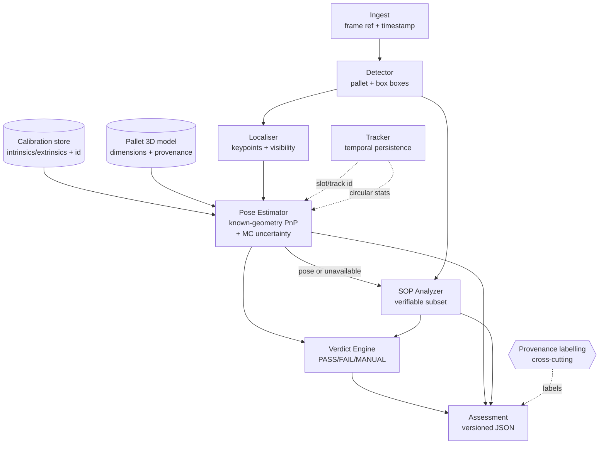

# Design Document

## Overview

This design describes a **Pallet Pose Estimation & Load Compliance** pipeline for the Delhivery take-home. A single fixed camera (~1.2 m high, tilted ~20° down) observes loaded pallets in numbered floor slots. For each detected pallet the system estimates metric pose (x, y in metres, orientation θ, face identity) in a defined floor frame and evaluates the eight-rule stacking standard SOP-PAL-03, producing one versioned JSON `Assessment` per pallet per image.

The design is scoped to a realistic **5-day build**. The overriding constraint is **honesty and provenance discipline** (R26, R27): every reported number carries a `Provenance_Label` ∈ {measured, simulated, estimated, unavailable}, and the system never fabricates training runs, calibration, ground truth, metrics, or hardware benchmarks. Where evidence is missing, the system says so with a `Reason_Code` rather than emitting a plausible-looking value. A confidently wrong pose or verdict is treated as the worst outcome; every stage is built to *degrade to unavailable / MANUAL_INSPECTION* rather than guess.

The ±2 cm / ±3° `Pose_Tolerance` is treated strictly as an **evaluation target** the system measures itself against and reports against (R11.4, R11.5) — never as a guaranteed accuracy level.

### Design principles

1. **Provenance-first.** Every result object is emitted with a provenance label and, where relevant, a reason code. This flows from data models through to the JSON schema and reports (R26, addressed as a cross-cutting mechanism in the Provenance section).
2. **Separate "found it" from "placed it".** Detection metrics and localisation metrics are computed and reported independently (R5).
3. **Geometry over shortcuts.** Pose uses known-geometry PnP with a 3D pallet model, not a floor homography on elevated corners and not bbox+tilt inference (R9.2, R9.3, R9.4).
4. **Degrade loudly.** Ill-conditioned, ambiguous, occluded, or high-uncertainty conditions produce explicit statuses, not silent point estimates (R9.5, R9.6, R13.4, R22, R27.2).
5. **Ship 70% honestly.** Where a stage cannot be completed (e.g. no measured pose ground truth, no target hardware), the design provides executable tooling plus a clearly labelled fallback and a stated blocker, rather than an overclaimed result (R10, R19.3, and scope-cut notes throughout).

### Scope posture (5-day realism)

| Area | Planned | Likely cut / fallback |
|------|---------|-----------------------|
| Detection+keypoint model | Train YOLO-pose on assembled dataset | If training blocked: executable train script + reported blocker, no metrics claimed (R4, R5.5) |
| Calibration | Checkerboard intrinsics + floor extrinsics, measured reprojection error | If no physical access: synthetic/simulated calibration clearly labelled (R8, R26.4) |
| Pose GT | Synthetic render (simulated) + a few measured floor points (measured) | Real-world compliance stated unverified if measured GT unavailable (R10.4) |
| SOP rules | Implement verifiable subset (overhang, height, column tilt, wrap presence, centroid) | Damage / hidden-region rules kept unresolved (R14, R15.3) |
| Target hardware | — | Jetson Orin Nano figures always "estimated/unmeasured" (R19.3, R20) |
| Quantisation | INT8 export + task-metric delta | Cut to estimate-only if time-boxed, labelled accordingly (R21) |

## Architecture

### Pipeline stages

The system is a single-image (with optional temporal aggregation) pipeline:

```
ingest → detect → keypoint/geometry localise → calibrate/pose → SOP analyse → verdict aggregate → assessment output
```

1. **Ingest** — load image/frame, attach frame ref + timestamp, validate integrity.
2. **Detect** — locate pallets and load-relevant objects (boxes); emit boxes + scores.
3. **Keypoint / geometry localise** — regress pallet corner/reference keypoints with visibility; this is the *localisation* stage measured separately from detection (R5).
4. **Calibrate / pose** — using the calibration artefacts and pallet 3D model, solve known-geometry PnP to metric pose; propagate uncertainty; reject ill-conditioned/ambiguous (R7–R13).
5. **SOP analyse** — evaluate the implemented SOP-PAL-03 subset; mark pose-dependent checks invalid when pose unreliable (R14–R16).
6. **Verdict aggregate** — combine pose quality + per-rule results into PASS / FAIL / MANUAL_INSPECTION with reason codes (R17).
7. **Assessment output** — serialise the versioned JSON `Assessment` with explicit nulls + reason codes for unavailable measurements (R24).

### Component diagram



Component boundaries map to the glossary: Detector, Localiser, Pose_Estimator, Calibrator, SOP_Analyzer, Verdict_Engine, plus a Tracker for temporal persistence (R23) and a cross-cutting Provenance mechanism.

### Project directory structure

```
pallet-pose-compliance/
├── README.md                 # approach, decisions+cost, results, 3 worst failures, unfinished, AI-tool usage (R29)
├── DATASET.md                # provenance, split, licences, biases, labelling guideline (R1, R2)
├── configs/
│   ├── sop_thresholds.yaml   # externalised SOP thresholds (R18)
│   ├── verdict.yaml          # verdict thresholds + weights (R17.6, R17.7)
│   ├── calibration/          # per-calibration-id artefacts + ids (R8.4)
│   └── pipeline.yaml         # seeds, model id, input resolution (R28.3)
├── src/
│   ├── detection/            # Detector wrapper + metrics (R4, R5)
│   ├── geometry/             # keypoint schema, coordinate frames, PnP, ray-plane (R7, R9)
│   ├── calibration/          # intrinsics/extrinsics load, reprojection error (R8)
│   ├── sop/                  # 8-rule triage table + implemented checks (R14–R16)
│   ├── tracking/             # temporal persistence, circular stats, movement detection (R23)
│   ├── output/               # Assessment schema, provenance, serialisation (R24, R26)
│   └── verdict/              # aggregation logic (R17)
├── scripts/
│   ├── annotate.py           # annotation tooling (R3)
│   ├── train.py              # training workflow (R4)
│   ├── eval.py               # detection/localisation/pose eval (R5, R11, R12)
│   ├── export.py             # INT8/export + quantisation cost (R21)
│   └── benchmark.py          # latency measurement, honest hardware (R19, R20)
├── tests/                    # unit + e2e; synthetic fixtures separate from real data (Testing Strategy)
├── data/                     # datasets (gitignored large); manifests tracked
├── weights/                  # trained + exported weights (R4.1)
├── reports/                  # measured/estimated result reports, decision log, checklist
└── outputs/                  # generated Assessments, illustrative examples (R25)
```

## Coordinate Systems and Conventions

All metric geometry is defined explicitly so unit tests can pin the conventions (R7.4, R9).

### Floor_Frame

- **Origin**: a documented, physically identifiable floor point (chosen as the near-left corner of slot 1, or the camera's ground-projected nadir if no slot fiducial is agreed). The chosen origin is recorded in `configs/calibration/<id>.yaml` with provenance.
- **Axes**: right-handed. **X** along the slot rows (increasing to camera-right), **Y** along the depth away from the camera, **Z** up (out of the floor). The floor plane is Z = 0.
- **Units**: metres for position; the floor is treated as planar (documented assumption; deviation feeds sensitivity analysis, R12).

### Pallet reference point

- The reported pallet position (x, y) is the **floor-projected pallet centre**: the centroid of the pallet's four bottom deckboard corners projected onto Z = 0. This is a floor-contact reference, distinct from the load's 3D centre of mass (relevant to SOP rule 7, see SOP section).

### Orientation

- **θ zero direction**: θ = 0 when the pallet's long axis is aligned with Floor_Frame **+X**.
- **Positive direction**: counter-clockwise viewed from above (+Z), consistent with right-handed frame.
- **Units**: degrees.
- **Wrap convention**: canonical range documented as **(−180°, 180°]**. All angle math uses `wrap_to_180`. When symmetry applies (below), the reported symmetry-reduced angle uses the modulo range and is flagged.

### Pallet physical dimensions and source

- Default model: standard warehouse pallet nominal footprint (e.g. 1200 × 800 mm) and deck height. **Source is documented** in `src/geometry/pallet_model.py` with a `Provenance_Label` of `estimated` (nominal spec) unless a specific pallet was physically measured (`measured`). Dimension uncertainty is carried into Monte Carlo propagation (R13.3).

### Face identity

- **Definition**: pallets are not rotationally symmetric in use; `Face_Identity` labels which physical face points toward the camera (e.g. `stringer_front`, `block_side`, `fork_entry`), derived from the asymmetric keypoint configuration.
- **Unresolved symmetry representation**: when the visible geometry is symmetric under a rotation (e.g. 180° for a symmetric deck), face identity cannot be uniquely resolved. This is represented as `face_identity: null` with `Reason_Code = FACE_AMBIGUOUS_SYMMETRY` and the admissible set recorded in the ambiguity field (R9.6, R9.7), never a silent pick.

## Components and Interfaces

### Detector (`src/detection`, R4, R5)

- **Model choice**: **YOLO-family pose/keypoint model** (e.g. Ultralytics YOLO11-pose or YOLOv8-pose), chosen because it is open-source, lightweight, jointly predicts boxes + keypoints in one pass (aligning detection and localisation stages), and is exportable to ONNX/TensorRT for the Jetson estimate path. Architecture and source are cited in README/DATASET (R4.2, R26.5).
- **Input resolution**: 640×640 default (configurable in `pipeline.yaml`); justified as the standard trade-off between small-object box visibility and latency, revisited in the latency plan (R20).
- **Interface**:
  - `detect(image) -> List[Detection]` where `Detection = {cls, bbox, score, keypoints: List[Keypoint]}`.
- **Losses / augmentations**: default box + keypoint (OKS) losses; augmentations limited to those that preserve metric geometry semantics (photometric jitter, mild scale, no vertical flip that would corrupt face identity). Choices + cost documented (R4.3, R4.4).
- **Training schedule / checkpoint selection**: fixed seed (R28.3), documented epochs/LR/batch, checkpoint selected by best held-out localisation metric (not training loss). All decisions + costs logged in the decision log (R4.3, R4.4).
- **Training-blocked fallback**: `scripts/train.py` is fully executable. If training cannot complete in-window (data/licence/compute blocker), the system reports the **blocker explicitly** and does **not** present a generic pretrained checkpoint as assignment-trained. Any inference run on a stock checkpoint is labelled `estimated` provenance and flagged as not-assignment-trained (R4, R5.5, R26.3).

### Localiser metrics (separate from detection, R5)

- **Detection metrics**: precision/recall and AP reported as **distributions** over the Held_Out_Set (per-image AP histogram, PR spread), with sample counts (R5.2, R5.4).
- **Localisation metrics**: per-keypoint **pixel error**, **normalised error** (by pallet bbox diagonal), **percentiles** (median/p90/p95), **visibility-conditioned** errors (visible vs occluded-but-labelled), and **failure rates** (missing/gross-outlier keypoints). Reported as distributions with sample counts (R5.3, R5.4).
- Both attach `measured` provenance **only** when computed from actual eval runs (R5.5).

### Keypoint / corner annotation schema (R3)

- Keypoints: the pallet's structural reference points — the four **bottom deck corners** (floor-contact, used for pose) plus the four **top deck corners** (for height/geometry), each with a **visibility label** ∈ {visible, occluded, absent}.
- Annotation tooling (`scripts/annotate.py`) writes a documented machine-readable format (COCO-keypoints-style JSON) whose schema matches the labelling guideline in DATASET.md (R3.2, R3.3).

### Calibrator (`src/calibration`, R8)

- **Interface**: `load_calibration(id) -> Calibration = {intrinsics K, distortion, extrinsics R|t (camera→Floor_Frame), reprojection_error, provenance}`.
- Reprojection error reported with provenance (R8.2, R8.3); each set has an id referenced by every Assessment (R8.4, R28.2).

### Pose_Estimator (`src/geometry`, R7, R9, R13)

- **Interface**: `estimate_pose(keypoints, calibration, pallet_model) -> PoseResult` where `PoseResult` carries either a valid metric pose + uncertainty or an `unavailable` status + reason code.
- Detailed method in "Data Models" and dedicated design notes below.

### SOP_Analyzer (`src/sop`, R14–R16)

- **Interface**: `analyze(detections, pose_result, sop_config) -> List[SopCheck]`.
- Owns the eight-rule triage table and the implemented subset.

### Verdict_Engine (`src/verdict`, R17)

- **Interface**: `aggregate(pose_result, sop_checks, verdict_config) -> VerdictResult`.

### Tracker (`src/tracking`, R23)

- **Interface**: `update(track_state, detection, pose_result) -> track_state` maintaining per-slot identity, circular-statistics orientation aggregation, and movement/stale detection.

### Output (`src/output`, R24, R26)

- **Interface**: `build_assessment(...) -> Assessment` (versioned JSON), plus provenance labelling helpers used across all stages.

## Data Models

### Provenance_Label

```
Provenance_Label = "measured" | "simulated" | "estimated" | "unavailable"
```
Attached to every reported result type (see Provenance mechanism section).

### Keypoint / Detection

```
Keypoint    = { name, u: px, v: px, visibility: "visible"|"occluded"|"absent", score }
Detection   = { cls: "pallet"|"box", bbox: [x,y,w,h], score, keypoints: [Keypoint] }
```

### Pallet 3D model

```
PalletModel = {
  bottom_corners_m: [[x,y,z]*4],   # z = 0 (floor contact)
  top_corners_m:    [[x,y,z]*4],   # z = deck+load-relevant height
  dimensions_m:     {length, width, deck_height},
  dim_uncertainty_m,               # feeds MC propagation
  source, provenance               # e.g. "estimated" nominal spec
}
```

### Pose method (known-geometry PnP)

- **Method**: solve for pallet pose in Floor_Frame using **PnP** with the pallet's known 3D model points and their observed image keypoints, then compose camera→floor extrinsics to express pose in Floor_Frame. This explicitly **accounts for keypoint height above the floor** (top corners are elevated; PnP uses their true Z), unlike a floor homography which would be invalid for elevated points (R9.2, R9.4). It is **not** bbox+tilt inference (R9.3).
- **Ray-plane intersection**: for floor-contact reference points (bottom corners), back-project the undistorted ray through the calibrated camera and intersect with Z = 0 to obtain a metric floor point; used to cross-check PnP and to place the floor-projected pallet centre (R9.4).
- **Distortion + visibility handling**: undistort keypoints with the calibrated distortion model before solving; use only `visible`/`occluded`-labelled points, requiring a documented minimum count and spatial spread; `absent` points excluded (R9.4).
- **Ill-conditioned / degenerate rejection**: reject when (a) too few usable keypoints, (b) near-collinear/coplanar-degenerate configuration, (c) high PnP residual, or (d) reprojection cross-check disagreement beyond a documented bound → emit `Quality_Flag = ILL_CONDITIONED` + `Reason_Code` and `pose_status = unavailable` (R9.5, R13.4).
- **Ambiguity representation**: when PnP admits multiple solutions (planar/near-planar ambiguity), record the **admissible solution set** rather than picking one silently (R9.6).
- **Orientation modulo symmetry**: when geometry is symmetric, report orientation reduced modulo the symmetry and flag it; face identity handled as in Conventions (R9.7).
- **Unavailable pose output**: a defined `PoseResult` with `pose_status = unavailable`, `Reason_Code`, and **null** metric fields — never a fabricated/zero pose (R13.4, and R24 null discipline).

```
PoseResult = {
  pose_status: "available" | "unavailable",
  reason_code,                     # when unavailable/degraded
  position_m:    {x, y} | null,
  orientation_deg | null,          # wrapped to (-180,180]
  orientation_symmetry_reduced: bool,
  face_identity | null,
  admissible_solutions,            # ambiguity set (R9.6)
  uncertainty: {                   # R13
    position_cov_m2, orientation_std_deg,
    method: "monte_carlo",
    assumptions,                   # keypoint/calib/dimension noise models
    provenance: "estimated"        # unless empirically calibrated
  },
  range_m, viewing_angle_deg,      # for envelope/sensitivity
  quality_flags: [ ... ],
  provenance
}
```

### Uncertainty via Monte Carlo propagation (R13)

- Sample keypoint pixel noise, calibration (intrinsics/extrinsics) noise, and pallet-dimension uncertainty from documented distributions; re-solve pose per sample; summarise the resulting pose spread as covariance/std (R13.1, R13.3). The method and its assumptions are documented; intervals are labelled **`estimated`/assumption-based** unless empirically calibrated against measured ground truth, in which case they may be upgraded to `measured` (R13.2, R13.3).

### SopCheck

```
SopCheck = {
  rule_id: 1..8, rule_name,
  triage: "verifiable"|"partially_verifiable"|"not_verifiable",
  status: "pass"|"fail"|"unresolved"|"invalidated",
  confidence,                      # value
  confidence_semantics: "raw_detector_score"|"calibrated_pass_probability"|"heuristic_evidence_quality",
  measurement, measurement_unit,   # e.g. overhang_cm; null + reason if unavailable
  uncertainty,
  threshold_used, threshold_source,# from config (R18)
  evidence_refs,                   # crops/keypoints/regions
  assumptions, hidden_regions,     # R14.3
  reason_code,
  provenance
}
```

### VerdictResult

```
VerdictResult = {
  verdict: "PASS"|"FAIL"|"MANUAL_INSPECTION",
  reason_codes: [...],
  reasoning_text,                  # human-readable (R17.8)
  pose_quality_weighting,          # documented (R17.7)
  contributing_checks: [rule_id...]
}
```

## Correctness Properties

*A property is a characteristic or behavior that should hold true across all valid executions of a system — essentially, a formal statement about what the system should do. Properties serve as the bridge between human-readable specifications and machine-verifiable correctness guarantees.*

The following properties were derived from the acceptance-criteria prework. Documentation-only criteria (e.g. DATASET.md contents, README sections, method write-ups) are satisfied by deliverables and are not encoded as properties. Redundant criteria were consolidated during property reflection (e.g. all per-object provenance criteria fold into Property 1; verdict criteria 17.2–17.5 fold into Property 14).

### Property 1: Every reported result carries a valid provenance label

*For all* result objects emitted by any stage (detection/localisation metrics, calibration reprojection error, pose GT, latency figures, quantisation cost, illustrative examples, Assessment fields), the object carries a `Provenance_Label` ∈ {measured, simulated, estimated, unavailable}, and a label of `measured` is present only when backing sample/measurement data exists.

**Validates: Requirements 5.5, 6.2, 8.3, 10.3, 19.2, 19.4, 21.3, 25.2, 26.1**

### Property 2: Provenance labels are never upgraded downstream

*For all* results labelled `simulated` (or `estimated`), no downstream transformation relabels them as `measured`; a simulated/synthetic result never surfaces as a real-world measurement.

**Validates: Requirements 26.2**

### Property 3: Unavailable results are stated, never fabricated

*For all* results whose provenance is `unavailable`, the value fields are explicit null with an accompanying `Reason_Code`, and are never emitted as a fabricated or zero value.

**Validates: Requirements 24.8, 26.4**

### Property 4: Reported distributions state a correct sample count

*For all* reported accuracy/error distributions (detection, localisation, translation, rotation), a `sample_count` field is present and equals the number of underlying samples.

**Validates: Requirements 5.4, 11.3**

### Property 5: Held-out evaluation is disjoint from training data

*For all* accuracy reports, the sample set used is drawn from the held-out manifest and is disjoint from the training manifest.

**Validates: Requirements 2.4**

### Property 6: Annotation round-trip preserves labels

*For all* annotations produced by the tooling, writing then reading back through the documented machine-readable format yields an equivalent annotation.

**Validates: Requirements 3.2**

### Property 7: Pose output completeness and valid ranges

*For all* pose results with `pose_status = available`, position (x, y in metres), orientation (in degrees, wrapped to (−180°, 180°]), face identity (or explicit null with a symmetry reason), and a quantified uncertainty object are all present; and *for all* results with `pose_status = unavailable`, those metric fields are null.

**Validates: Requirements 7.1, 7.2, 7.3, 13.1, 27.1**

### Property 8: Unreliable pose degrades to unavailable, never fabricated

*For all* keypoint/calibration inputs that are ill-conditioned, degenerate, or exceed the documented uncertainty threshold, the pose result has `pose_status = unavailable` with a `Reason_Code` and null metrics — never a fabricated or zero pose.

**Validates: Requirements 9.5, 13.4, 27.2**

### Property 9: Known-geometry projection round-trip recovers pose

*For all* synthetic pallets placed at a known pose, projecting the 3D model points (respecting keypoint height above the floor and lens distortion) into the image and then solving pose recovers the original pose within a documented numerical tolerance.

**Validates: Requirements 9.2, 9.4**

### Property 10: Orientation is invariant under geometric symmetry

*For all* poses and their symmetry-equivalent counterparts (rotated by the pallet's symmetry), the symmetry-reduced orientation is equal.

**Validates: Requirements 9.7**

### Property 11: Ambiguous geometry yields a solution set, not a silent pick

*For all* inputs constructed to be geometrically ambiguous, the result's `admissible_solutions` contains more than one solution (or is explicitly flagged ambiguous), never a single silently selected pose.

**Validates: Requirements 9.6**

### Property 12: Usable-envelope classification partitions evaluated conditions

*For all* evaluated operating conditions, each is labelled exactly one of {meets_tolerance, fails_tolerance, insufficient_evidence}, and the classification never extrapolates beyond evaluated conditions.

**Validates: Requirements 12.4**

### Property 13: Tolerance evaluation is computed consistently

*For all* error distributions and the ±2 cm / ±3° tolerance, the reported pass-fraction equals the proportion of samples within the threshold, reported both per-axis and radially for translation.

**Validates: Requirements 11.4**

### Property 14: SOP triage covers all eight rules

*For all* triage tables, every rule id 1..8 appears exactly once with a classification ∈ {verifiable, partially_verifiable, not_verifiable}.

**Validates: Requirements 14.1, 14.4**

### Property 15: Triage classification determines implementation

*For all* rules triaged `verifiable` or `partially_verifiable`, an implemented check exists in the check registry; rules triaged `not_verifiable` have no implemented check.

**Validates: Requirements 15.1**

### Property 16: SOP status discipline

*For all* pallet outputs: rules triaged `not_verifiable` appear with status `unresolved` (never pass/fail/omitted); and when pose is unavailable, every pose-dependent check has status `invalidated` with a `Reason_Code`.

**Validates: Requirements 15.3, 15.4**

### Property 17: Per-check confidence has valid, honest semantics

*For all* implemented SOP checks, a confidence value and a `confidence_semantics` label ∈ {raw_detector_score, calibrated_pass_probability, heuristic_evidence_quality} are present, and a confidence derived without calibration is never labelled `calibrated_pass_probability`.

**Validates: Requirements 16.1, 16.2, 16.3, 16.4**

### Property 18: Verdict aggregation truth table with critical-failure dominance

*For all* check sets: the verdict is always one of {PASS, FAIL, MANUAL_INSPECTION}; a confirmed mandatory violation yields FAIL; adequate evidence that all mandatory rules pass yields PASS; inadequate mandatory evidence with no confirmed violation yields MANUAL_INSPECTION; and adding any number of passing checks to a set containing a confirmed critical failure never changes the verdict away from FAIL.

**Validates: Requirements 17.1, 17.2, 17.3, 17.4, 17.5**

### Property 19: SOP thresholds are driven by configuration

*For all* threshold values set in the external config, the corresponding SOP check uses that value (changing the config changes the check boundary) without any source change.

**Validates: Requirements 18.2**

### Property 20: Every Assessment is schema-valid, versioned, and round-trips

*For all* processed images with N detected pallets, exactly N Assessments are produced; each includes schema version, pallet id, timestamp, source-image ref, pose+uncertainty, orientation, face identity, all eight SOP verdicts with confidence, overall verdict + reasoning, quality flags, reason codes, per-stage timings, and a failure signal + reason code when processing failed; and serialising then parsing the Assessment yields an equivalent object with unavailable fields as explicit null (never zero).

**Validates: Requirements 17.8, 22.1, 22.3, 24.1, 24.2, 24.3, 24.4, 24.5, 24.6, 24.8, 25.1**

### Property 21: Model and calibration identifiers are present and resolvable

*For all* Assessments, `model_id` and `calibration_id` are present and resolve to a known model/calibration set.

**Validates: Requirements 8.4, 24.7, 28.2**

### Property 22: Orientation temporal aggregation uses correct circular statistics

*For all* sets of per-frame orientation angles, the aggregated orientation is the circular mean (e.g. the mean of 179° and −179° is ≈ 180°, not 0°), correct across the wrap boundary.

**Validates: Requirements 23.2**

### Property 23: Deterministic runs are reproducible

*For all* fixed seed + fixed config + identical input, repeated pipeline runs produce identical Assessments.

**Validates: Requirements 28.3**

## Error Handling

Every failure mode maps to a machine-readable status + `Reason_Code`, degrades loudly, and is surfaced in the Assessment (R22, R27). The pipeline never emits a plausible-but-fabricated value in place of a failure.

| Condition | Handling | Status / Reason_Code | CLI exit |
|-----------|----------|----------------------|----------|
| No detections in image | Emit Assessment with no pallet observations | `NO_PALLET_DETECTED` (distinct from failure) | 0 (`no pallet`) |
| Occlusion / missing keypoints | If usable-keypoint minimum unmet → pose unavailable | `POSE_INSUFFICIENT_KEYPOINTS` | 0 |
| Unknown / uncertain dimensions | Widen dimension uncertainty in MC; if intolerable → unavailable | `DIMENSIONS_UNKNOWN` | 0 |
| Ambiguous orientation | Represent admissible set; face identity null | `POSE_AMBIGUOUS`, `FACE_AMBIGUOUS_SYMMETRY` | 0 |
| Ill-conditioned / degenerate PnP | Reject solution, pose unavailable | `ILL_CONDITIONED` | 0 |
| Excessive pose uncertainty | Degrade pose→unavailable; pose-dependent SOP→invalidated; verdict→MANUAL | `POSE_UNCERTAINTY_EXCEEDED` | 0 |
| Invalid calibration / suspected camera movement | Flag calibration; block metric pose | `CALIBRATION_INVALID`, `CAMERA_MOVED` | 0 |
| Blur / lighting / domain shift | Low detector/keypoint confidence → degrade affected checks | `LOW_IMAGE_QUALITY` | 0 |
| Corrupt input / runtime error | No Assessment values fabricated; emit failure signal | `PROCESSING_FAILED` | non-zero (`processing failed`) |

The CLI **distinguishes "no pallet" (exit 0, valid empty result) from "processing failed" (non-zero exit)** so downstream consumers can tell absence of load from system failure (R22.2). Uncertainty exceeding a documented per-result threshold triggers automatic degradation to `unavailable` / `MANUAL_INSPECTION` with a reason (R27.2), implemented once in the output layer and exercised by Property 8 and Property 18.

## Testing Strategy

The system uses a **dual approach**: unit tests for specific examples/edge cases/error conditions, and property-based tests for universal properties. Both are required and complementary — unit tests catch concrete bugs and pin conventions; property tests verify general correctness across generated inputs. **Synthetic-fixture unit tests are kept strictly separate from real-data validation**, and INT8 calibration data is kept separate from any test/eval set (R21, honesty discipline).

### Unit tests (examples, edge cases, error conditions)

- **Projection & coordinate conventions**: fixed synthetic pallet → known pixel projections; Floor_Frame origin/axis sign checks.
- **Angle wrapping & symmetry**: `wrap_to_180` boundaries (180°, −180°, 0°); symmetry reduction fixed cases.
- **Unit conversion**: metres↔centimetres, radians↔degrees exact examples.
- **Uncertainty-propagation sanity**: zero input noise → zero output spread; monotonic growth with input noise.
- **Threshold boundaries**: SOP checks exactly at ±3 cm overhang, 1.8 m height, 15° tilt, 10 cm centroid (from config).
- **Missing / invalid evidence**: null keypoints, invalid calibration, corrupt image → correct status + reason.
- **Verdict logic**: hand-built PASS / FAIL / MANUAL / critical-failure-dominance cases.
- **JSON schema validation**: valid and deliberately invalid Assessments against the versioned schema.
- **End-to-end smoke test**: run the full pipeline on one available image (or one synthetic frame) and assert a schema-valid Assessment is produced.

### Property-based tests

- **Library**: use an established PBT library for the target language (Python → **Hypothesis**); do **not** hand-roll property testing.
- **Iterations**: each property test runs a **minimum of 100 iterations**.
- **Tagging**: each test carries a comment referencing its design property in the format **`Feature: pallet-pose-compliance, Property {number}: {property_text}`**.
- **One-to-one**: each of the 23 correctness properties above is implemented by a **single** property-based test.
- Generators cover edge cases explicitly (empty/whitespace, non-ASCII in refs, wrap-boundary angles, degenerate keypoint configurations, symmetric geometries, near-zero and large ranges), so edge-case criteria (e.g. occlusion, encoding, large inputs) are exercised through generation rather than as separate properties.

Property tests that exercise pose geometry use **simulated** renders with known projection labels (never ground truth generated from the estimator under test, R10). Real-data validation, where a measured set exists, is reported separately with `measured` provenance; if no measured set is available, real-world compliance is stated **unverified** and only simulated validation is reported (R10.4, R12).

## Provenance & Honesty Mechanism (cross-cutting design element)

Provenance is a first-class design element, not a reporting afterthought (R26, R27):

- **`Provenance_Label` type** is attached to every result-bearing object in the data models (metrics, calibration, pose, SOP checks, latency, quantisation, Assessment fields). The output layer refuses to serialise a result-bearing field without a label (enforced and tested by Property 1).
- **Label flow**: labels are assigned at the point of computation and **propagated, never upgraded**, through aggregation into the Assessment and into every report in `reports/` (Property 2). A `simulated` pose GT stays `simulated` in the pose-error report; an `estimated` Jetson figure stays `estimated` in the README.
- **Unavailable discipline**: missing measurements are emitted as explicit null + reason code, never zero or a placeholder (Property 3).
- **Decision log** (`reports/decision_log.md`): every significant decision with its cost (R4.3/4.4, R29.1) and, per R29.5, the AI-tool usage note including one thing an AI tool got wrong that was caught.
- **Requirements checklist** (`reports/requirements_checklist.md`): R1–R29 mapped to where each is satisfied (code, config, doc, or property), including honestly-marked unfinished items (R29.4) — supporting the "finish 70% honestly over abandon 95%" posture.

## Deployment & Robustness Notes

- **Latency / benchmark plan** (`scripts/benchmark.py`, R19, R20): measure and report latency **only on the actual hardware used**, labelled `measured` with the hardware named. **Jetson Orin Nano 15 W / 15 FPS figures are reported strictly as `estimated`/unmeasured reasoning** and never as measured on target hardware (R19.3, R19.4, R20.3).
- **Quantisation / export** (`scripts/export.py`, R21): INT8 export measuring the **task-relevant** deltas — keypoint pixel precision, pose error, tolerance success rate, and **changed SOP verdicts** — not just AP; INT8 calibration data kept separate from the test set; results labelled with provenance.
- **Temporal persistence** (`src/tracking`, R23): per-slot tracking with **circular statistics** for orientation aggregation (Property 22), movement detection with stale-state reset, and treatment of correlated frames as non-independent (effective sample size, not naive count). Documented note: **temporal averaging reduces variance but does not remove systematic calibration bias**.

## Review

This design covers all 29 requirements (R1–R29) with traceability noted per section and per property. Please review the architecture, coordinate conventions, pose method, SOP triage/verdict logic, output schema, and the honesty/provenance mechanism. I can return to requirements clarification if any gaps are identified. Once you approve the design, we can proceed to the tasks phase.
